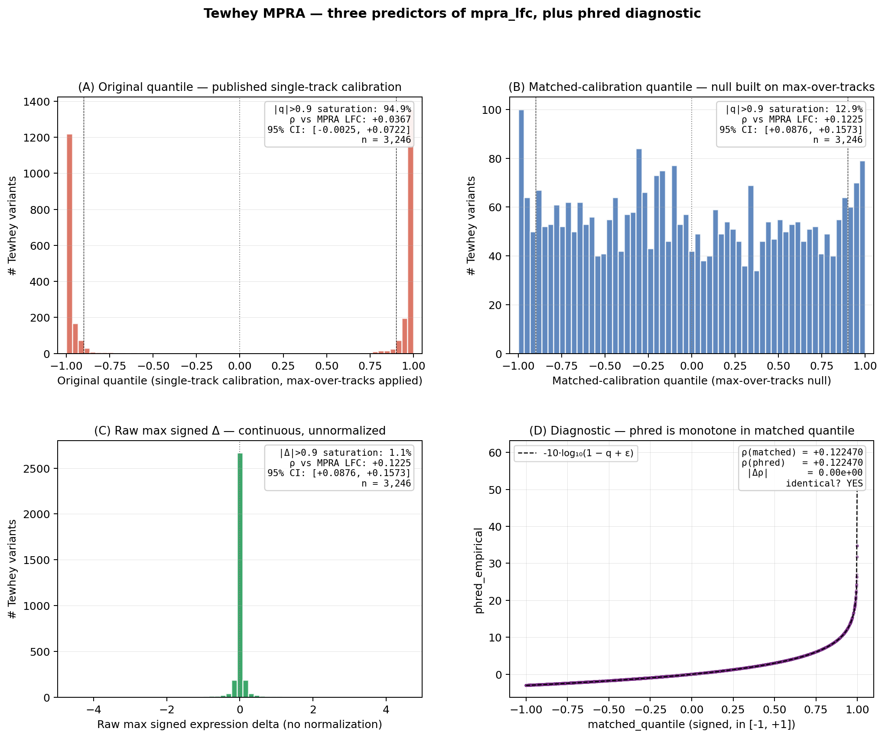

# Calibration-statistic mismatch in AlphaGenome variant scoring

[](LICENSE)
[](https://www.python.org/)

---

AlphaGenome's published quantile-calibrated scoring uses single-track summary statistics. When max-over-tracks aggregation is applied to these outputs — a common composition for tissue-level variant scoring — saturation collapses signed correlation against measured MPRA log fold change from ρ = 0.123 to ρ = 0.037 (n = 3,246), with 94.9% of regulatory variants pinned at |score| > 0.9. Re-deriving the quantile calibration using matched max-over-tracks statistics on a common-variant null recovers the full underlying signal at ρ = 0.123 (95% CI [0.088, 0.157], p = 2.5×10⁻¹²). The saturation is an artifact of the calibration-statistic mismatch, not of the model. The fix is methodological: match calibration summary statistics to the use case.

---



*Distribution of three score variants on Tewhey variants. (A) Original quantile (single-track calibration) — 94.9% saturated at |score| > 0.9. (B) Matched-calibration quantile — full range populated, 12.9% saturated. (C) Raw signed delta — continuous distribution near zero. (D) Phred vs matched-quantile, demonstrating monotonic relationship.*

---

## Why this happens

AlphaGenome's published `quantile_score` is computed by ranking each variant's per-track raw score against an empirical background of ~300,000 common variants (gnomAD / 1000 Genomes, MAF > 0.01). The calibration is correct for its design purpose: a single-track score in [−1, +1] where 0.9 means "this variant has a larger predicted regulatory effect on this track than 90% of common genetic variation." That is the right tool for ranking candidates within a fine-mapped credible set at one locus.

The problem appears at validation time, through two mechanisms.

**Mechanism 1 — selection bias.** MPRA panels and eQTL datasets are not random: they are assembled from variants that already showed up in GWAS, passed regulatory annotation filters, or were selected specifically because they might be functional. By the same logic that makes them interesting to study, they are enriched for regulatory activity relative to background.

**Mechanism 2 — calibration-statistic mismatch.** Tissue-level pipelines aggregate single-track scores with a summary statistic — typically the maximum signed value across all tissue-relevant expression tracks. Composing that order statistic on top of single-track-calibrated quantiles is what produces saturation: for *n* tracks the chance that *some* track exceeds the 0.9 single-track quantile is 1 − 0.9ⁿ, so with 20–30 K562 tracks the max exceeds 0.9 with probability ~88–96% — for *any* variant, regulatory or not.

Empirically, on **5,941 random common autosomal variants** (gnomAD MAF > 0.01, sampled genome-wide):

|  | Saturation \|score\| > 0.9 | Exactly ±1 |
|---|---|---|
| Matched null (raw max-over-tracks Δ — calibration matches the test statistic) | **0.42 %** | 0.000 % |
| Published single-track quantile (single-track calibration, max-over-tracks applied) | **41.3 %** | 1.1 % |

The ~100× gap on identical variants is the direct demonstration: saturation is produced by composing a single-track-calibrated output with a different-statistic aggregation, not by any property of the variants being scored. Mechanism 1 (selection bias) pushes regulatory-enriched panels somewhat further into the tail than random common variation, but mechanism 2 explains the bulk of the effect — including most of the saturation seen on random common variation itself.

This is not a bug in AlphaGenome. The published calibration is faithful to its construction (single-track empirical quantiles). The lesson generalizes: any tool that publishes a quantile calibrated against one summary statistic and is then aggregated with a different one will exhibit the same artifact.

---

## Findings

3,301 variants from the Tewhey 2016 MPRA panel (GSE75661) — a set of regulatory loci drawn from GWAS studies — were scored. Successful raw deltas were obtained for 3,275; the four-way comparison below is on the 3,246 variants that have valid values for all four predictors. Before concluding the model failed, four alternative explanations for the original near-zero ρ = +0.036 were ruled out:

- Allele orientation mismatch (ref/alt flipped vs. MPRA A/B convention) — 100% match via Ensembl
- Wrong LFC column — `mpra_lfc = B − A` matches Tewhey 2016 directly
- Score saturation — confirmed, 94.9% of original-quantile scores are above |0.9|
- Coordinate drift hg19 → hg38 — 5/5 spot-checked positions exact

The diagnosis is saturation. Magnitude correlation actually survives in the published-quantile output — |score| vs |LFC| gives ρ = +0.108 across the full panel, and among the top-5% highest-effect variants the signed correlation rises to ρ = +0.271. The model is tracking the right biology. It is the calibration's summary statistic that compresses everything into the same bin.

Re-quantiling each Tewhey variant against the matched (max-over-tracks) common-variant null built in this work — described in `docs/matched_calibration.md` — recovers the full signal:

| Predictor | Spearman ρ vs MPRA LFC | 95% CI | p | n |
|---|---|---|---|---|
| Original quantile (single-track calibration, max applied) | +0.0367 | [−0.0025, +0.0722] | 3.6×10⁻² | 3,246 |
| Matched-calibration quantile (max-over-tracks calibration) | **+0.1225** | [+0.0876, +0.1573] | 2.5×10⁻¹² | 3,246 |
| Phred empirical (`-10·log₁₀(1 − q + ε)`, monotone transform of #2) | +0.1225 | [+0.0876, +0.1573] | 2.5×10⁻¹² | 3,246 |
| Raw max signed expression delta (no normalization) | +0.1225 | [+0.0876, +0.1573] | 2.6×10⁻¹² | 3,246 |

Matched-quantile, phred empirical, and raw max signed delta produce identical Spearman to numerical precision because they are strictly monotone transforms of each other on the relevant Tewhey range — Spearman is rank-based and invariant to monotone transforms. The difference between them is scale and distribution shape, not rank ordering. The published quantile is a different rank ordering, which is where the correlation is lost.

Saturation snapshot on the Tewhey panel:

| Predictor | \|·\| > 0.9 |
|---|---|
| Original quantile | 94.9 % |
| Matched quantile | 12.9 % |
| Raw max signed Δ | 1.1 % |


The distribution comparison makes the issue concrete. Original-quantile scores pile up near ±1 — bimodal, no room to rank. Raw deltas (and equivalently matched quantiles) form a smooth continuous distribution centered near zero. Most variants have small effects; a few have large ones. That's what you need to correlate against an MPRA.


Breaking down by effect size shows where each predictor succeeds. Among variants with large measured effects (|LFC| > 0.5), raw deltas reach ρ = +0.614; the original-quantile score gets to +0.245. In the low-effect bins where most variants sit, the original quantile is near zero or negative, while raw deltas stay modestly positive.

| \|LFC\| bin | Original quantile ρ | n | Raw / matched ρ | n |
|---|---|---|---|---|
| 0 – 0.05 | −0.015 | 1,512 | +0.092 | 281 |
| 0.05 – 0.10 | −0.000 | 892 | +0.099 | 168 |
| 0.10 – 0.20 | +0.044 | 553 | +0.383 | 93 |
| 0.20 – 0.50 | +0.185 | 242 | +0.031 | 43 |
| > 0.50 | +0.245 | 60 | **+0.614** | 15 |

Saturation is not specific to Tewhey's MPRA design or to neurological/metabolic disease GWAS. Platelet count GWAS variants (n = 198) saturate at 99.0%; hemoglobin GWAS variants (n = 195) at 100%. Different biology, different paradigm, same calibration-statistic mismatch driving the saturation:

| Variant set | n | Original-quantile expression \|score\| > 0.9 |
|---|---|---|
| Tewhey MPRA | 3,259 | 94.9 % |
| Disease GWAS — expression | 767 | 99.6 % |
| Disease GWAS — chromatin | 767 | 69.4 % |
| Disease GWAS — TF binding | 767 | 31.9 % |
| Platelet count GWAS | 198 | 99.0 % |
| Hemoglobin GWAS | 195 | 100.0 % |

The Disease GWAS rows show n = 767 because that's the subset of the 1,125 scored variant-disease pairs with `signed_max_score` cached at the time the saturation figure was generated. The saturation gradient across modalities is mechanistic: expression scores aggregate across three track types (RNA-seq, CAGE, PRO-cap), so the max over more tracks pushes more variants to the tail. TF binding, using only one track type, saturates the least at 32%.


For completeness, the empirical CDF of the original-quantile score on regulatory-enriched sets vs. the diagonal expected under faithful single-track calibration:


*Empirical CDF of |expression subscore| (original quantile, single-track calibration with max-over-tracks applied) for two regulatory-enriched variant sets, plotted against the theoretical uniform distribution expected under faithful calibration. Both empirical curves pile up near 1 while the diagonal stays linear. Tewhey MPRA (94.9 % above 0.9) and disease GWAS variants (99.6 % above 0.9) are entirely compressed into the same extreme bin.*

---

## Methods

### Matched-statistic calibration

**5,941** random common autosomal SNVs were sampled from **66 windows of 50 kb** placed proportional to chromosome length (chr1 → 7 windows; chr19–22 → 1 each), at uniformly-random offsets ≥ 1 Mb from chromosome ends, autosomes only, seed = 2026. Sex chromosomes were excluded for simplicity. Within each window, variants were fetched and filtered to MAF > 0.01 via gnomAD v3 GraphQL (the same allele-frequency source AlphaGenome calibrates against), keeping biallelic SNVs only and dropping any variant whose rsID appears in the Tewhey panel (3 dropped). The procedure is reproducible from the seed alone.

Each variant was scored through AlphaGenome v0.6.1 with the K562/blood-lineage tissue profile, expression-modality filter (RNA_SEQ + CAGE + PROCAP), and the same per-variant 60-second timeout used by `batch_score.py`. Scoring was parallelized 4-way with a write lock around the SQLite cache. The score retained per variant is the matched summary statistic — the max signed value of `raw_score` over the K562 expression tracks. The peak track's published `quantile_score` was also retained for the saturation comparison.

The smoking-gun result on the **same** 5,941 random common variants:

| | Saturation \|·\| > 0.9 | Exactly ±1 |
|---|---|---|
| Matched null (raw max-over-tracks Δ) | **0.42 %** | 0.000 % |
| Published single-track quantile (peak track) | **41.3 %** | 1.1 % |

This is the direct evidence that single-track calibration composed with max-over-tracks aggregation produces saturation independently of regulatory enrichment. With the matched null in hand, applying the calibration to a test variant is a percentile rank against the empirical CDF of `raw_max_signed_delta` in `matched_calibration_null.parquet`, mapped linearly to [−1, +1]. Full procedure and parameters in [`docs/matched_calibration.md`](docs/matched_calibration.md).


---

## What this means in practice

The original-quantile score and the matched-calibration / raw-delta score answer different questions. Using either one for the wrong purpose gives a misleading answer.

For **variant prioritization within a credible set** — asking which of five fine-mapped candidates has the largest regulatory footprint — the original (single-track) quantile is exactly right. APOE illustrates this well: rs429358 (ε4) scores −0.9996 and rs7412 (ε2) scores +0.9976, opposite signs that match their opposing Alzheimer's risk effects. That relative ordering is meaningful, and it is what the published single-track calibration is built to produce. The problem is when you take those same scores and try to rank thousands of variants across different loci against each other. Once everything compresses to ±1, you have lost the information about which variants are actually different from each other.

For **correlation with an experimental measurement** — an MPRA, a CRISPRi screen, a set of eQTL effect sizes — you want a continuous predictor on a calibrated scale. Matched-calibration quantiles (from this work) and raw deltas are both viable; they are rank-equivalent on the relevant range, so they give identical Spearman against MPRA LFC, and the choice is one of presentation:

- **Matched quantiles** are on a calibrated [−1, +1] scale comparable across variants and studies, with a defined null (the common-variant background under the matched summary statistic).
- **Raw deltas** carry the original effect-size units of the underlying tracks but are not directly comparable across studies without their own null.

The practical consequences extend in a few directions. There is an active debate in the field about how well deep learning regulatory models actually generalize — papers benchmarking AlphaGenome, Enformer, Sei, and others against MPRA or eQTL data consistently report correlations in the 0.1–0.3 range, and the field treats these as a ceiling on what the models can do. If those benchmarks are using a published quantile that was calibrated under a different summary statistic than the one applied at evaluation time, the ceiling is partially artificial.

For rare disease interpretation, the distinction matters more directly. A de novo regulatory variant in a patient is not interesting because it ranks in the 99th percentile of common variation under a saturated single-track-calibrated max — it is interesting if it is predicted to substantially disrupt expression of a dosage-sensitive gene. Matched-calibration scores or raw deltas separate variants by predicted effect size; the saturated original quantile would call most candidates extreme and give no way to tell them apart.

---

## Setup

You need Python 3.11+ and an AlphaGenome API key ([request access here](https://alphagenome.google)). The scoring runs are included in the repo as cached databases, so you can reproduce all figures without re-running the API.

```bash
git clone https://github.com/kavya1a/regulatory-score-saturation.git
cd regulatory-score-saturation
pip install -r requirements.txt
cp .env.example .env
# add ALPHAGENOME_API_KEY to .env
```

To regenerate all figures from cached data (about a minute, no API key needed):

```bash
make figures
```

To run the matched-calibration build + Tewhey re-analysis end-to-end (~70 minutes of API time, 4-way parallel):

```bash
make matched_calibration
```

The build is fully resume-able via `matched_calibration_cache.db`, so re-running picks up where it left off.

Full pipeline from scratch — fetch, score GWAS, score Tewhey, raw-delta extraction (~20 hours of API):

```bash
make pipeline
make figures
make verify
```

`make verify` runs canonical variant tests. Three of five pass. Per-variant rationale and the two failures are in [`docs/canonical_variants.md`](docs/canonical_variants.md).

---

## Repo structure

```
├── README.md
├── TEWHEY_RESULT.md             # raw-delta diagnostic writeup (pre-matched-calibration)
├── config.yaml                  # tissue profiles, canonical variants, matched_calibration block
│
├── batch_score.py               # score GWAS variants → scored_variants.db
├── prefetch_variants.py         # GWAS Catalog → preloaded_variants.db
├── tewhey_analysis.py           # download + score Tewhey MPRA panel
├── extract_raw_deltas.py        # raw expression delta extraction (Tewhey)
├── build_matched_calibration.py # Component 2: build matched null on common variants
├── analyze_matched_calibration.py # Component 3: 4-way Tewhey re-analysis
├── saturation_figure.py         # saturation CDF figures
├── phase2_figures.py            # distribution and LFC-bin figures
├── phase3_blood_traits.py       # blood trait replication
├── gwas_catalog.py              # GWAS Catalog v2 client
├── allele_resolver.py           # Ensembl allele resolution + cache
│
├── scoring/                     # AlphaGenome scoring utilities
├── verification/                # canonical variant test harness
├── figures/                     # all generated figures
├── docs/                        # methodology + canonical variants + matched_calibration.md
└── archive/                     # pre-pivot scripts, kept for reference
```

All scoring results are included so you can inspect the data or regenerate figures without API access:

| File | Contents |
|---|---|
| `scored_variants.db` | 1,125 GWAS variant-disease pairs across 4 diseases (767 with per-modality `signed_max_score` cached) |
| `tewhey_mpra.parquet` | Tewhey 2016 panel with original-quantile expression scores (3,259 variants) |
| `tewhey_raw_delta_cache.db` | Raw expression deltas for full Tewhey panel (3,301 rows; 3,275 usable) |
| `matched_calibration_cache.db` | Per-variant raw delta + single-track quantile for the 5,941-variant null |
| `matched_calibration_null.parquet` | Clean matched null distribution used for re-quantiling |
| `matched_calibration_comparison.csv` | Four-row Spearman table from `analyze_matched_calibration.py` |
| `phase3_blood_cache.db` | Original-quantile scores for 393 blood trait GWAS variants |
| `variants.db` | Ensembl allele resolution cache |

Data sources: Tewhey 2016 MPRA (GSE75661, GRCh38 liftover) · GWAS Catalog v2 · Ensembl REST API · gnomAD v3 GraphQL · AlphaGenome v0.6.1

---

## Limitations

**Sample size.** The Tewhey full panel has 3,301 variants; raw-delta extraction succeeded on 3,275; the four-way comparison restricts to the 3,246 variants where all four predictors are simultaneously valid. An earlier stratified pilot (n = 600, 120 per |LFC| quintile) gave ρ = +0.174 — higher than the full panel because the stratification over-represents the high-|LFC| tail, which is where raw deltas correlate best. The full-panel n = 3,246 is the population-level number.

**Single-tissue track aggregation.** The matched null and Tewhey scores both use the max signed value across K562/blood-lineage expression tracks (RNA-seq, CAGE, PRO-cap). This picks whichever single track moves most, discarding co-regulation structure across the remaining tracks. The reported ρ = +0.123 is a lower bound on what a track-aware aggregation (weighted mean, PCA first component) would achieve with the same model outputs and the same matched-calibration recipe.

**Tissue mismatch.** Raw deltas use K562/blood-lineage tissue profiles. Tewhey 2016 measured regulatory activity in LCLs (lymphoblastoid cell lines), which have different chromatin accessibility and TF occupancy. This mismatch suppresses correlation — ρ = +0.123 is a lower bound on what a correctly matched tissue profile would give.

**Phred-scaled outputs may be available in newer SDK versions.** This analysis used the published linear quantile from the Nature paper (AlphaGenome SDK v0.6.1). A grep across SDK source, all ten tagged releases, the issue tracker, the docs, and the supplement found no phred-scaled output. The `phred_empirical` reported here is derived locally from the matched null and is a strict monotone transform of the matched quantile; it is not identical to any internal phred convention DeepMind may use.

**Raw / matched output access required.** Recovering the directional signal requires either access to per-track raw outputs or a matched-statistic null. Some tool deployments only expose the published quantile; in those settings, none of the rank-equivalent predictors above can be reconstructed without re-scoring the calibration set.

**Blood trait replication is partial.** Saturation on platelet count and hemoglobin GWAS variants is confirmed using the published quantile. The matched-calibration recipe has not been applied to those panels.

**Canonical tests: 3/5 pass.** The two failures are documented in [`docs/canonical_variants.md`](docs/canonical_variants.md).

### What would change the interpretation

The interpretation here rests on a specific causal story about the calibration-statistic mismatch. Two experiments would directly probe it:

- **Matched-tissue scoring.** Re-running raw delta extraction with LCL (lymphoblastoid) tracks instead of K562 should bring the model into the cell type Tewhey 2016 actually measured. If the K562/LCL mismatch is suppressing correlation, matched-tissue ρ should rise. If it stays flat or falls, ρ = +0.123 reflects the model's true ceiling on this dataset rather than a tissue artifact, and the story needs revising. Not run.
- **Median or mean aggregation across tracks.** If max-over-tracks is the operation that creates the order-statistic mismatch, replacing max with per-track median or mean across the 20–30 K562 tracks should substantially reduce saturation rates under the published quantile on the same panels — both Tewhey and the matched null. Equivalent saturation under mean aggregation would falsify the calibration-statistic-mismatch half of the story. Not run.

---

## Acknowledgments

This analysis was substantially sharpened by feedback from Žiga Avsec (Google DeepMind), who reviewed an earlier version and identified that the published quantile calibration uses single-track summary statistics. The matched-statistic experiment in this work followed directly from that observation.

---

## Citation

```bibtex
@misc{amrutham2026calibration,
  author = {Amrutham, Kavya},
  title  = {Calibration-statistic mismatch in AlphaGenome variant scoring},
  year   = {2026},
  url    = {https://github.com/kavya1a/regulatory-score-saturation}
}
```

---

*AlphaGenome model and API by Google DeepMind.*
