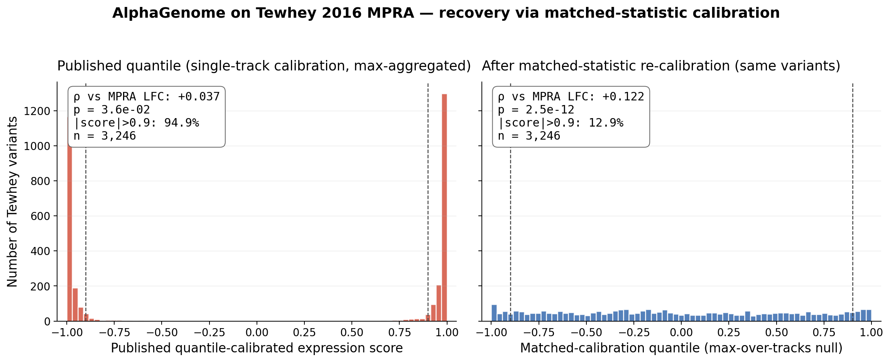
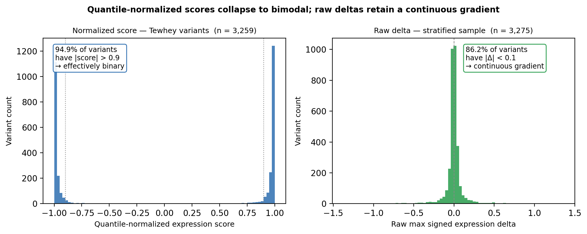
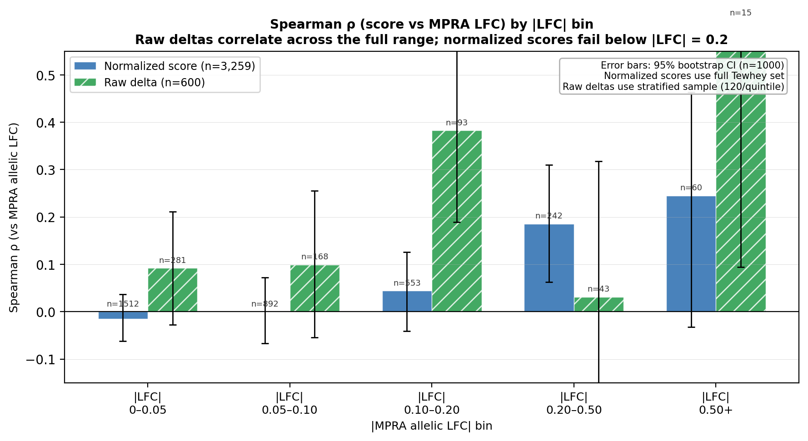
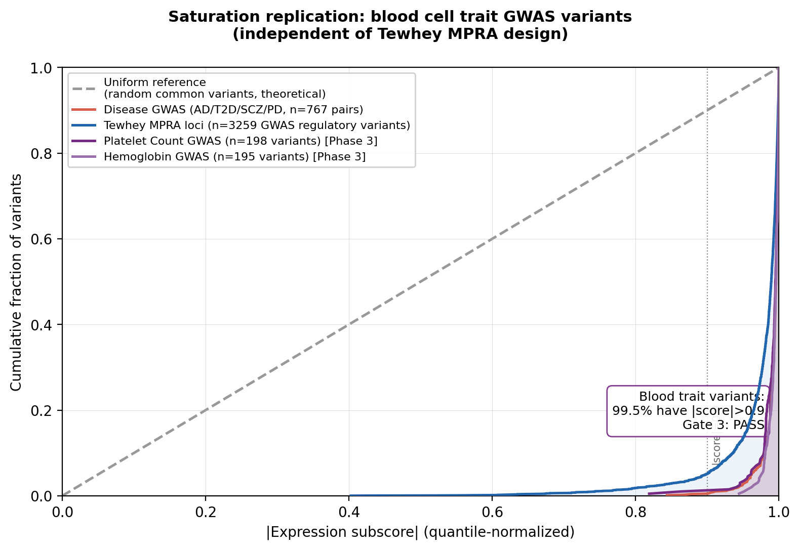
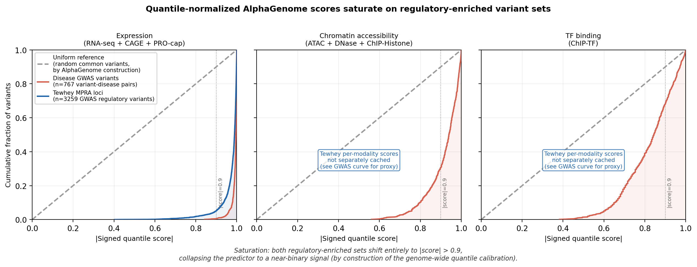
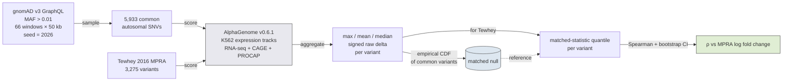
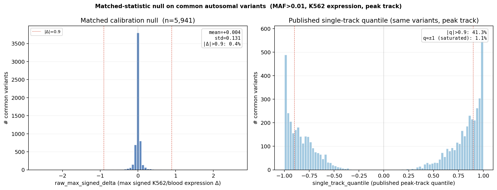
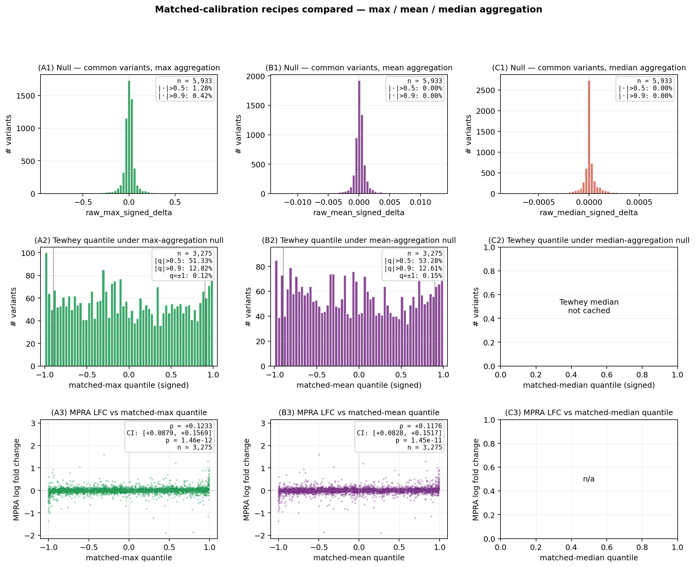

# Calibration-statistic mismatch in AlphaGenome variant scoring

[](LICENSE)
[](https://www.python.org/)
[](https://github.com/kavya1a/regulatory-score-saturation/actions/workflows/ci.yml)



*The same 3,246 Tewhey 2016 MPRA variants, scored through AlphaGenome twice. Left: published quantile-calibrated expression score — 94.9% saturated at |score| > 0.9, Spearman vs measured LFC collapsed to ρ = +0.037. Right: matched-statistic re-calibration of the same K562 raw deltas against a common-variant null built from the same summary statistic — distribution populated, ρ = +0.123 (p = 2.5×10⁻¹²). The signal was always there; the published calibration's summary statistic doesn't match the aggregation used downstream.*

---

- **Published-quantile pile-up.** 94.9% of regulatory variants pin at |score| > 0.9; signed correlation against MPRA log fold change collapses to ρ = +0.037 (n = 3,246).
- **Matched-statistic re-calibration recovers the signal.** Re-deriving the quantile against a 5,933-variant max-over-tracks common-variant null gives ρ = +0.123 (95% CI [+0.088, +0.157], p = 2.5×10⁻¹², same variants).
- **Mechanism cleanly separates into two parts.** Swapping max for mean/median aggregation on the same null drops saturation from 0.42% to 0.00% above |0.9| — the order-statistic effect is real and isolated. The ~13% residual saturation on Tewhey under any matched recipe is regulatory enrichment, not order-statistic inflation.
- **Aggregation choice doesn't matter once matched calibration is in place.** Max, mean, and median give Spearman within each other's CIs on Tewhey (ρ ≈ +0.12); the matched recipe absorbs the choice.

The fix is methodological: match calibration summary statistics to the use case, and the choice of aggregation downstream becomes a presentation decision rather than a science one.

## Reproduce in 5 minutes

[](https://colab.research.google.com/github/kavya1a/regulatory-score-saturation/blob/main/notebooks/reproduce.ipynb)

The fastest path is the Colab notebook (`notebooks/reproduce.ipynb`) — it reproduces the headline ρ recovery and the three-recipe finding in ~15 seconds from cached data, no setup required.

Locally:

```bash
git clone https://github.com/kavya1a/regulatory-score-saturation.git
cd regulatory-score-saturation
pip install -r requirements.txt
make figures                                    # regenerate all figures from cached data
python analyze_matched_calibration_recipes.py   # three-recipe comparison from scratch
```

No AlphaGenome API key needed — all scoring outputs are cached in the repo. See [Setup](#setup) for the full path including re-scoring through the API.

---

## Why this happens

AlphaGenome's published `quantile_score` is computed by ranking each variant's per-track raw score against an empirical background of ~300,000 common variants (gnomAD / 1000 Genomes, MAF > 0.01). The calibration is correct for its design purpose: a single-track score in [−1, +1] where 0.9 means "this variant has a larger predicted regulatory effect on this track than 90% of common genetic variation." That is the right tool for ranking candidates within a fine-mapped credible set at one locus.

The problem appears at validation time, through two mechanisms that are routinely conflated but are mechanistically separable.

**Mechanism 1 — calibration-statistic mismatch (order-statistic inflation).** Tissue-level pipelines aggregate single-track scores with a summary statistic — typically the maximum signed value across all tissue-relevant expression tracks. Composing that order statistic on top of single-track-calibrated quantiles is what produces the bulk of the saturation: for *n* tracks the chance that *some* track exceeds the 0.9 single-track quantile is 1 − 0.9ⁿ, so with the hundreds of K562 expression tracks AlphaGenome actually exposes, the max exceeds 0.9 with probability approaching 1 — for *any* variant, regulatory or not. This is a property of the aggregation operation, not the variants.

**Mechanism 2 — selection bias.** MPRA panels and eQTL datasets are not random: they are assembled from variants that already showed up in GWAS, passed regulatory annotation filters, or were selected specifically because they might be functional. By the same logic that makes them interesting to study, they are enriched for regulatory activity relative to background.

Empirically, on **5,933 random common autosomal variants** (gnomAD MAF > 0.01, sampled genome-wide; same variants used for the matched-calibration null in this work):

| Aggregation of K562 expression raw deltas | Saturation \|·\| > 0.9 on common variants | Saturation \|·\| > 0.5 |
|---|---|---|
| Max-over-tracks (the pipeline statistic) | **0.42 %** | 1.28 % |
| Mean-over-tracks | **0.00 %** | 0.00 % |
| Median-over-tracks | **0.00 %** | 0.00 % |
| Published single-track quantile (single-track calibration, max applied) | **41.4 %** | — |

The first three rows isolate the order-statistic effect on identical variants: swapping max for mean or median on the raw side eliminates tail inflation on the common-variant null. The fourth row is what users see when the published per-track quantile is composed with max — the same variants now hit 41% saturation, two orders of magnitude higher. That ~100× gap is mechanism 1 alone, on variants with no regulatory enrichment.

Mechanism 2 (selection bias) explains why the saturation rate on regulatory-enriched panels (94.9% on Tewhey) is higher still than on common variants (41%): regulatory variants sit further into the tail of any aggregation. But unlike mechanism 1, it isn't fixed by the matched-calibration recipe — after re-calibrating against a matched null, ~13% of Tewhey variants still land above |0.9|. That residual is biology.

This is not a bug in AlphaGenome. The published calibration is faithful to its construction (single-track empirical quantiles). The lesson generalizes: any tool that publishes a quantile calibrated against one summary statistic and is then aggregated with a different one will exhibit the same order-statistic artifact.

---

## Findings

3,301 Tewhey 2016 MPRA variants (GSE75661) — regulatory loci drawn from GWAS studies — were scored through AlphaGenome v0.6.1. Raw deltas were obtained for 3,275; the four-way comparison below uses the 3,246 variants with valid values across all four predictors. Allele orientation (vs Ensembl), LFC column choice, and hg19→hg38 lift were verified before the analysis (see `verification/` and `docs/canonical_variants.md`); magnitude correlation already survives in the published-quantile output (|score| vs |LFC| gives ρ = +0.108 across the panel and ρ = +0.271 among the top-5% highest-effect variants), so the model is tracking the right biology — only the calibration's summary statistic compresses it.

Re-quantiling each Tewhey variant against the matched (max-over-tracks) common-variant null built in this work — described in `docs/matched_calibration.md` — recovers the full signal:

| Predictor | Spearman ρ vs MPRA LFC | 95% CI | p | n |
|---|---|---|---|---|
| Original quantile (single-track calibration, max applied) | +0.0367 | [−0.0025, +0.0722] | 3.6×10⁻² | 3,246 |
| Matched-calibration quantile (max-over-tracks calibration) | **+0.1225** | [+0.0876, +0.1573] | 2.5×10⁻¹² | 3,246 |
| Phred empirical (`-10·log₁₀(1 − q + ε)`, monotone transform of #2) | +0.1225 | [+0.0876, +0.1573] | 2.5×10⁻¹² | 3,246 |
| Raw max signed expression delta (no normalization) | +0.1225 | [+0.0876, +0.1573] | 2.6×10⁻¹² | 3,246 |

Matched-quantile, phred empirical, and raw max signed delta produce identical Spearman to numerical precision because they are strictly monotone transforms of each other on the relevant Tewhey range — Spearman is rank-based and invariant to monotone transforms. The difference between them is scale and distribution shape, not rank ordering. The published quantile is a different rank ordering, which is where the correlation is lost.

Saturation snapshot on the Tewhey panel:

| Predictor | \|·\| > 0.9 |
|---|---|
| Original quantile | 94.9 % |
| Matched quantile | 12.9 % |
| Raw max signed Δ | 1.1 % |



The distribution comparison makes the issue concrete. Original-quantile scores pile up near ±1 — bimodal, no room to rank. Raw deltas (and equivalently matched quantiles) form a smooth continuous distribution centered near zero. Most variants have small effects; a few have large ones. That's what you need to correlate against an MPRA.



Breaking down by effect size shows where each predictor succeeds. Among variants with large measured effects (|LFC| > 0.5), raw deltas reach ρ = +0.614; the original-quantile score gets to +0.245. In the low-effect bins where most variants sit, the original quantile is near zero or negative, while raw deltas stay modestly positive.

| \|LFC\| bin | Original quantile ρ | n | Raw / matched ρ | n |
|---|---|---|---|---|
| 0 – 0.05 | −0.015 | 1,512 | +0.092 | 281 |
| 0.05 – 0.10 | −0.000 | 892 | +0.099 | 168 |
| 0.10 – 0.20 | +0.044 | 553 | +0.383 | 93 |
| 0.20 – 0.50 | +0.185 | 242 | +0.031 | 43 |
| > 0.50 | +0.245 | 60 | **+0.614** | 15 |

The non-monotone pattern in the raw/matched column at the 0.20–0.50 bin reflects small-sample noise (n = 43); bins below 0.10 and the > 0.50 bin are the more stable estimates.

Saturation is not specific to Tewhey's MPRA design or to neurological/metabolic disease GWAS. Platelet count GWAS variants (n = 198) saturate at 99.0%; hemoglobin GWAS variants (n = 195) at 100%. Different biology, different paradigm, consistent with the calibration-statistic mismatch documented above:

| Variant set | n | Original-quantile expression \|score\| > 0.9 |
|---|---|---|
| Tewhey MPRA | 3,259 | 94.9 % |
| Disease GWAS — expression | 767 | 99.6 % |
| Disease GWAS — chromatin | 767 | 69.4 % |
| Disease GWAS — TF binding | 767 | 31.9 % |
| Platelet count GWAS | 198 | 99.0 % |
| Hemoglobin GWAS | 195 | 100.0 % |

The Disease GWAS rows show n = 767 because that's the subset of the 1,125 scored variant-disease pairs with `signed_max_score` cached at the time the saturation figure was generated. The saturation gradient across modalities is mechanistic: expression scores aggregate across three track types (RNA-seq, CAGE, PRO-cap), so the max over more tracks pushes more variants to the tail. TF binding, using only one track type, saturates the least at 32%.



For completeness, the empirical CDF of the original-quantile score on regulatory-enriched sets vs. the diagonal expected under faithful single-track calibration:



*Empirical CDF of |expression subscore| (original quantile, single-track calibration with max-over-tracks applied) for two regulatory-enriched variant sets, plotted against the theoretical uniform distribution expected under faithful calibration. Both empirical curves pile up near 1 while the diagonal stays linear. Tewhey MPRA (94.9 % above 0.9) and disease GWAS variants (99.6 % above 0.9) are entirely compressed into the same extreme bin.*

---

## Methods



*Pipeline shape. Same scoring path runs over both the common-variant null and the Tewhey panel; the per-variant aggregation produces three parallel summary statistics (max/mean/median) that build three parallel matched-calibration nulls. Tewhey variants are then re-quantiled against each null and compared against measured MPRA LFC by Spearman.*

### Matched-statistic calibration

**5,933** random common autosomal SNVs (5,995 attempted, 60 errors, 2 timeouts) were sampled from **66 windows of 50 kb** placed proportional to chromosome length (chr1 → 7 windows; chr19–22 → 1 each), at uniformly-random offsets ≥ 1 Mb from chromosome ends, autosomes only, seed = 2026. Sex chromosomes were excluded for simplicity. Within each window, variants were fetched and filtered to MAF > 0.01 via gnomAD v3 GraphQL (the same allele-frequency source AlphaGenome calibrates against), keeping biallelic SNVs only and dropping any variant whose rsID appears in the Tewhey panel (3 dropped). The procedure is reproducible from the seed alone.

Each variant was scored through AlphaGenome v0.6.1 with the K562/blood-lineage tissue profile, expression-modality filter (RNA_SEQ + CAGE + PROCAP), and the same per-variant 60-second timeout used by `batch_score.py`. Scoring was parallelized 4-way with a write lock around the SQLite cache. Three summary statistics are retained per variant: the max, mean, and median signed `raw_score` across all K562 expression tracks. The peak track's published `quantile_score` is also retained for the saturation comparison.

**Smoking-gun result.** Saturation on the **same** 5,933 random common variants under three pre-quantile aggregations:

| Aggregation of per-track `raw_score` | Saturation \|·\| > 0.9 | Saturation \|·\| > 0.5 |
|---|---|---|
| Max-over-tracks | **0.42 %** | 1.28 % |
| Mean-over-tracks | **0.00 %** | 0.00 % |
| Median-over-tracks | **0.00 %** | 0.00 % |
| Published single-track quantile (peak track, for reference) | **41.4 %** | — |

This isolates the order-statistic mechanism: variants don't change, the model doesn't change, only the aggregation operation changes. Max inflates the tail; mean and median don't. The published quantile sits at 41% because it is the per-track empirical quantile of the peak track — a different layer of order statistic on top of the same per-track outputs.

**Three-recipe Tewhey comparison.** Re-quantiling each Tewhey variant against the matched null built under each of the three aggregations gives:

| Recipe (matched null built from…) | Tewhey quantile \|·\| > 0.9 | Spearman ρ vs MPRA LFC | 95% CI |
|---|---|---|---|
| Max-over-tracks | 12.82 % | +0.1233 | [+0.0879, +0.1569] |
| Mean-over-tracks | 12.61 % | +0.1176 | [+0.0828, +0.1517] |
| Median-over-tracks | — *(Tewhey median not extracted)* | — | — |

Two things to read out of this. **First**, the three recipes are essentially interchangeable for the Tewhey ranking task — Spearman differs by 0.006 (well within each other's bootstrap CIs), and tail saturation under matched calibration sits at ~13% regardless of aggregation. The matched-calibration recipe absorbs the choice. **Second**, the residual ~13% saturation on Tewhey *is not* the order-statistic effect (which the matched recipe eliminates on the common-variant null); it is regulatory enrichment, the unavoidable consequence of asking "do these MPRA-selected variants sit further from common-variant baseline than common variants do." That's a feature, not a bug — under faithful calibration, regulatory variants *should* land in the tail.

With the matched null in hand, applying the calibration to a test variant is a percentile rank against the empirical CDF of `raw_max_signed_delta` (or `raw_mean_signed_delta`, or median) in `matched_calibration_null.parquet`, mapped linearly to [−1, +1]. Full procedure and parameters in [`docs/matched_calibration.md`](docs/matched_calibration.md); three-recipe outputs in `matched_recipes_comparison.csv` and the figure below.





*Three-recipe matched-calibration comparison. Rows: null distributions on common variants (A1–C1), Tewhey re-quantiled against each null (A2–C2), and MPRA LFC vs each matched quantile (A3–C3). The order-statistic effect lives in row 1 — max stretches the null tail, mean and median don't. The Tewhey signal is preserved in row 3 regardless of aggregation choice.*

---

## What this means in practice

The original-quantile score and the matched-calibration / raw-delta score answer different questions. Using either one for the wrong purpose gives a misleading answer.

For **variant prioritization within a credible set** — asking which of five fine-mapped candidates has the largest regulatory footprint — the original (single-track) quantile is exactly right. APOE illustrates this well: rs429358 (ε4) scores −0.9996 and rs7412 (ε2) scores +0.9976, opposite signs that match their opposing Alzheimer's risk effects. That relative ordering is meaningful, and it is what the published single-track calibration is built to produce. The problem is when you take those same scores and try to rank thousands of variants across different loci against each other. Once everything compresses to ±1, you have lost the information about which variants are actually different from each other.

For **correlation with an experimental measurement** — an MPRA, a CRISPRi screen, a set of eQTL effect sizes — you want a continuous predictor on a calibrated scale. Matched-calibration quantiles (from this work) and raw deltas are both viable; they are rank-equivalent on the relevant range, so they give identical Spearman against MPRA LFC, and the choice is one of presentation:

- **Matched quantiles** are on a calibrated [−1, +1] scale comparable across variants and studies, with a defined null (the common-variant background under the matched summary statistic).
- **Raw deltas** carry the original effect-size units of the underlying tracks but are not directly comparable across studies without their own null.

The practical consequences extend in a few directions. There is an active debate in the field about how well deep learning regulatory models actually generalize — papers benchmarking AlphaGenome, Enformer, Sei, and others against MPRA or eQTL data consistently report correlations in the 0.1–0.3 range, and the field treats these as a ceiling on what the models can do. Whether other benchmarks face a similar calibration-statistic artifact depends on whether the aggregation applied at evaluation differs from the summary statistic the published calibration was built on; that is a hypothesis suggested by the AlphaGenome result above, not a claim about specific tools.

For rare disease interpretation, the distinction matters more directly. A de novo regulatory variant in a patient is not interesting because it ranks in the 99th percentile of common variation under a saturated single-track-calibrated max — it is interesting if it is predicted to substantially disrupt expression of a dosage-sensitive gene. Matched-calibration scores or raw deltas separate variants by predicted effect size; the saturated original quantile would call most candidates extreme and give no way to tell them apart.

---

## Setup

You need Python 3.11+ and an AlphaGenome API key ([request access here](https://alphagenome.google)). The scoring runs are included in the repo as cached databases, so you can reproduce all figures without re-running the API.

```bash
git clone https://github.com/kavya1a/regulatory-score-saturation.git
cd regulatory-score-saturation
pip install -r requirements.txt
cp .env.example .env
# add ALPHAGENOME_API_KEY to .env
```

To regenerate all figures from cached data (about a minute, no API key needed):

```bash
make figures
```

To run the matched-calibration build + Tewhey re-analysis end-to-end (~70 minutes of API time, 4-way parallel):

```bash
make matched_calibration
```

The build is fully resume-able via `matched_calibration_cache.db`, so re-running picks up where it left off.

Full pipeline from scratch — fetch, score GWAS, score Tewhey, raw-delta extraction (~20 hours of API):

```bash
make pipeline
make figures
make verify
```

`make verify` runs canonical variant tests in two groups: `canonical_rank_recovery` (3 tests — variant lands in top 20% of its disease set) and `canonical_regulatory_detection` (2 tests — AlphaGenome assigns strong regulatory effect even when not differentiated from other GWAS variants at the locus). All five tests pass under this split. Per-variant rationale and the per-modality outrank diagnosis for rs7903146 / rs356219 are in [`docs/canonical_variants.md`](docs/canonical_variants.md).

---

## Repo structure

```
├── README.md
├── config.yaml                  # tissue profiles, canonical variants, matched_calibration block
│
├── prefetch_variants.py         # GWAS Catalog → preloaded_variants.db
├── batch_score.py               # score GWAS variants → scored_variants.db
├── extract_raw_deltas.py        # raw expression delta extraction (Tewhey)
├── build_matched_calibration.py # Component 2: build matched null on common variants (max/mean/median)
├── analyze_matched_calibration.py         # Component 3: 4-way Tewhey re-analysis
├── analyze_matched_calibration_recipes.py # Component 4: three-recipe matched-cal comparison
├── analyze_mean_aggregation.py            # raw-side max vs mean on Tewhey
├── saturation_figure.py         # saturation CDF figures
├── phase2_figures.py            # distribution and LFC-bin figures
├── phase3_blood_traits.py       # blood trait replication
├── make_hero_figure.py          # README hero figure
├── gwas_catalog.py              # GWAS Catalog v2 client
├── allele_resolver.py           # Ensembl allele resolution + cache
│
├── scoring/                     # AlphaGenome scoring utilities
├── verification/                # canonical variant test harness
├── tests/                       # unit tests
├── notebooks/                   # Colab-runnable reproduction notebook
├── figures/                     # all generated figures
├── docs/                        # methodology + canonical variants + data dictionary
└── archive/                     # pre-pivot scripts and superseded artifacts
```

All scoring results are included so you can inspect the data or regenerate figures without API access:

| File | Contents |
|---|---|
| `scored_variants.db` | 1,125 GWAS variant-disease pairs across 4 diseases (767 with per-modality `signed_max_score` cached) |
| `tewhey_mpra.parquet` | Tewhey 2016 panel with original-quantile expression scores (3,259 variants) |
| `tewhey_raw_delta_cache.db` | Raw expression deltas for full Tewhey panel (3,301 rows; 3,275 usable) |
| `matched_calibration_cache.db` | Per-variant max / mean / median raw delta + single-track quantile for the 5,933-variant null |
| `matched_calibration_null.parquet` | Clean matched null distribution used for re-quantiling |
| `matched_calibration_comparison.csv` | Four-row Spearman table from `analyze_matched_calibration.py` |
| `matched_recipes_comparison.csv` | Three-recipe (max/mean/median) saturation + Spearman from `analyze_matched_calibration_recipes.py` |
| `mean_aggregation_comparison.csv` | Tewhey raw-side max vs mean from `analyze_mean_aggregation.py` |
| `phase3_blood_cache.db` | Original-quantile scores for 393 blood trait GWAS variants |
| `variants.db` | Ensembl allele resolution cache |

Per-column schemas for every artifact above are documented in [`docs/data_dictionary.md`](docs/data_dictionary.md).

Data sources: Tewhey 2016 MPRA (GSE75661, GRCh38 liftover) · GWAS Catalog v2 · Ensembl REST API · gnomAD v3 GraphQL · AlphaGenome v0.6.1

---

## Limitations

**Sample size.** The Tewhey full panel has 3,301 variants; raw-delta extraction succeeded on 3,275; the four-way comparison restricts to the 3,246 variants where all four predictors are simultaneously valid. An earlier stratified pilot (n = 600, 120 per |LFC| quintile) gave ρ = +0.174 — higher than the full panel because the stratification over-represents the high-|LFC| tail, which is where raw deltas correlate best. The full-panel n = 3,246 is the population-level number.

**Single-tissue track aggregation.** The matched null and Tewhey scores both use the max signed value across K562/blood-lineage expression tracks (RNA-seq, CAGE, PRO-cap). This picks whichever single track moves most, discarding co-regulation structure across the remaining tracks. The reported ρ = +0.123 is a lower bound on what a track-aware aggregation (weighted mean, PCA first component) would achieve with the same model outputs and the same matched-calibration recipe.

**Tissue mismatch.** Raw deltas use K562/blood-lineage tissue profiles. Tewhey 2016 measured regulatory activity in LCLs (lymphoblastoid cell lines), which have different chromatin accessibility and TF occupancy. This mismatch suppresses correlation — ρ = +0.123 is a lower bound on what a correctly matched tissue profile would give.

**Phred-scaled outputs may be available in newer SDK versions.** This analysis used the published linear quantile from the Nature paper (AlphaGenome SDK v0.6.1). A grep across SDK source, all ten tagged releases, the issue tracker, the docs, and the supplement found no phred-scaled output. The `phred_empirical` reported here is derived locally from the matched null and is a strict monotone transform of the matched quantile; it is not identical to any internal phred convention DeepMind may use.

**Raw / matched output access required.** Recovering the directional signal requires either access to per-track raw outputs or a matched-statistic null. Some tool deployments only expose the published quantile; in those settings, none of the rank-equivalent predictors above can be reconstructed without re-scoring the calibration set.

**Blood trait replication is partial.** Saturation on platelet count and hemoglobin GWAS variants is confirmed using the published quantile. The matched-calibration recipe has not been applied to those panels.

**Canonical tests: 5/5 pass under a two-group split.** Three rank-recovery tests (rs429358 AD, APOE direction, rs1006737 SCZ) plus two regulatory-detection tests (rs7903146 TCF7L2, rs356219 SNCA). The detection group exists because rs356219 is outranked by 40–96% of PD GWAS variants on every modality — no linear reweighting can recover top-20% rank, so the strict rank claim is replaced with a "model assigns strong regulatory effect" claim. See [`docs/canonical_variants.md`](docs/canonical_variants.md).

### What would change the interpretation

The interpretation here rests on a specific causal story. The order-statistic prediction has been tested; the tissue-mismatch prediction has not.

- **Median or mean aggregation across tracks (DONE).** Replacing max with mean or median on the same K562 raw deltas drops common-variant saturation from 0.42% (max) to 0.00% (mean, median) on identical variants — confirming the order-statistic mechanism. Under the matched-calibration recipe, all three aggregations give essentially identical Tewhey rankings (Spearman ρ within each other's CIs; ~13% saturation under matched quantile regardless of aggregation). The order-statistic effect is real on the null distribution; the residual Tewhey saturation under matched calibration is regulatory enrichment, not an aggregation artifact. See the three-recipe comparison in `analyze_matched_calibration_recipes.py` and `figures/matched_recipes_comparison.png`.
- **Matched-tissue scoring (NOT RUN).** Re-running raw delta extraction with LCL (lymphoblastoid) tracks instead of K562 should bring the model into the cell type Tewhey 2016 actually measured. If the K562/LCL mismatch is suppressing correlation, matched-tissue ρ should rise. If it stays flat or falls, ρ = +0.123 reflects the model's true ceiling on this dataset rather than a tissue artifact, and the story needs revising.

---

## Citation

```bibtex
@misc{amrutham2026calibration,
  author = {Amrutham, Kavya},
  title  = {Calibration-statistic mismatch in AlphaGenome variant scoring},
  year   = {2026},
  url    = {https://github.com/kavya1a/regulatory-score-saturation}
}
```

---

*AlphaGenome model and API by Google DeepMind.*
