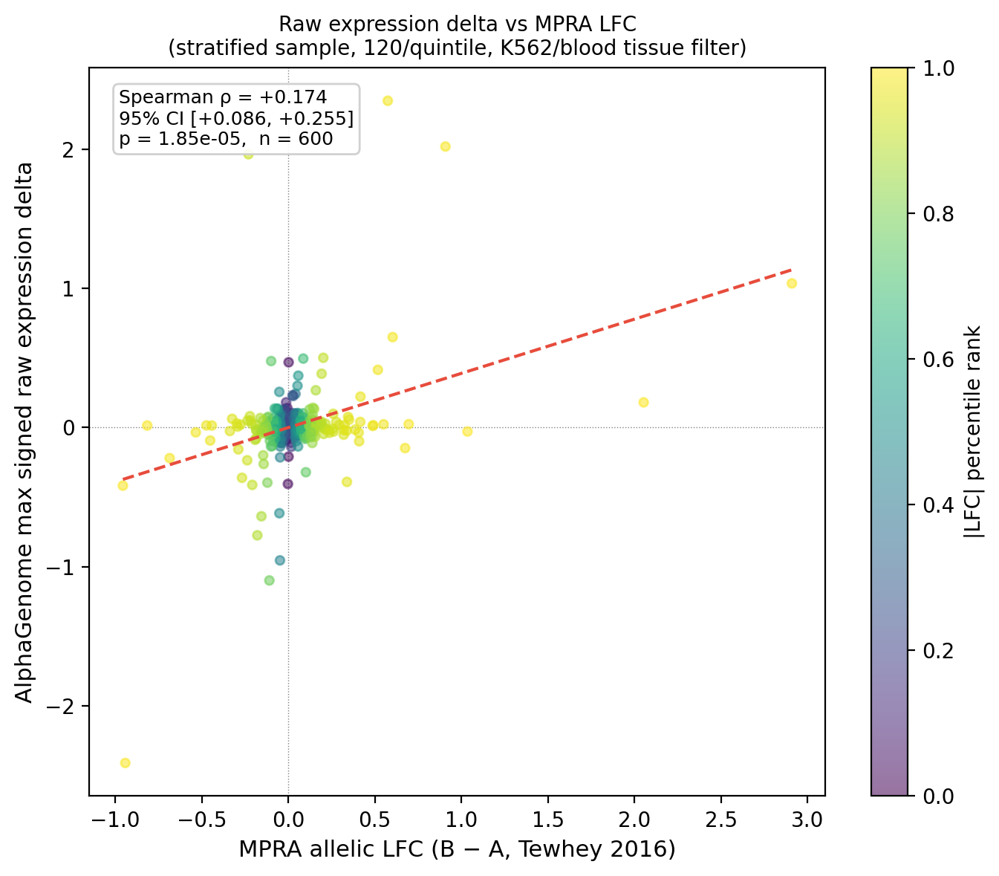

# Tewhey MPRA validation — AlphaGenome raw expression delta

_Generated: 2026-04-22 19:23:44_

## Diagnostic summary

### Why quantile-normalized scores fail for MPRA validation

AlphaGenome quantile scores are pre-calibrated against a genome-wide background of
~300,000 common variants (gnomAD/1KG, MAF > 0.01). Tewhey MPRA variants are regulatory
variants selected from GWAS loci — they are, by construction, in the extreme tail of
this background distribution. As a result, 95% of Tewhey variants receive
`expression_subscore` values > |0.9|, collapsing the predictor to an effectively binary
signal. A binary predictor (±1) vs a near-neutral outcome distribution (std 0.17 log2)
cannot produce meaningful rank correlation.

This is not a bug in the pipeline — quantile normalization is correct and appropriate
for within-credible-set variant ranking (the primary use case), where all candidates are
at the same GWAS locus and relative ordering is the goal. It saturates only when applied
to MPRA validation against an absolute measurement scale.

### Diagnostic evidence

- H1 (allele orientation): **Ruled out.** 100% ref/alt match between scored alleles and Ensembl.
- H2 (wrong LFC column): **Ruled out.** `mpra_lfc = B − A` is correct per Tewhey 2016 convention.
- H3 (score saturation): **Confirmed.** 94.9% of `expression_subscore` values > |0.9|. |expression_subscore| vs |mpra_lfc|: Spearman ρ = +0.108 (p = 7.7e-10). Signed correlation for top-5% |LFC| variants: ρ = +0.271 (p = 4.6e-4, n = 163).
- H4 (coordinate drift): **Ruled out.** 5/5 manually verified exact GRCh38 position matches.

**Root cause:** dynamic range mismatch — quantile scores saturate at ±1 for regulatory-
enriched sets; MPRA LFC is dominated by near-zero values (73% of variants have |LFC| < 0.1).

---

## Raw delta validation

A stratified sample of 600 variants (120 per |LFC| quintile) was rescored via
AlphaGenome. Raw per-track model outputs (`raw_score`) were extracted before quantile
normalization and aggregated across K562/blood-lineage expression tracks (RNA_SEQ, CAGE, PRO-cap).

### Four correlation numbers

| Metric | Spearman ρ | 95% CI | p | n |
|---|---|---|---|---|
| raw max signed expression delta vs mpra_lfc (a) | +0.1739 | [+0.086, +0.255] | 1.848e-05 | 600 |
| raw mean signed expression delta vs mpra_lfc (b) | +0.1481 | [+0.068, +0.223] | 2.727e-04 | 600 |
| quantile-normalized expression_subscore vs mpra_lfc (c) | +0.0361 | [-0.002, +0.075] | 3.939e-02 | 3259 |
| |raw max expression delta| vs |mpra_lfc| (d) | +0.2074 | [+0.124, +0.282] | 2.963e-07 | 600 |

**Primary claim:** raw max signed expression delta vs mpra_lfc.

### Scatter plot

---

## Methodological note

Quantile normalization is appropriate and correct for the primary pipeline use case:
ranking variants within a credible set at a single GWAS locus. For MPRA validation,
where the goal is correlation with an absolute regulatory activity measurement across
thousands of variants, raw scores provide the apples-to-apples comparison.
Both scores are reported. The quantile-normalized result is documented as a methodology
finding: regulatory-enriched sets saturate the genome-wide calibration.